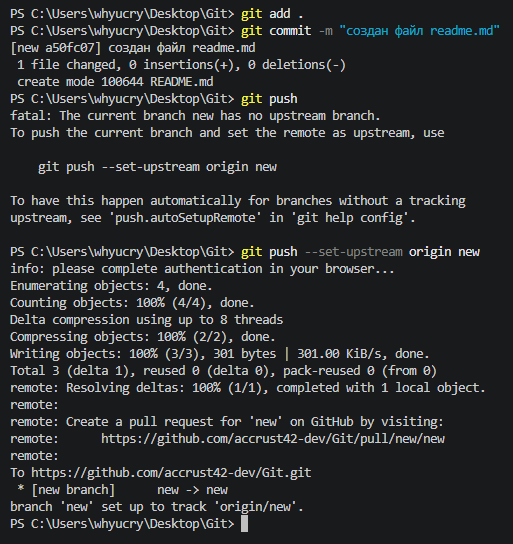
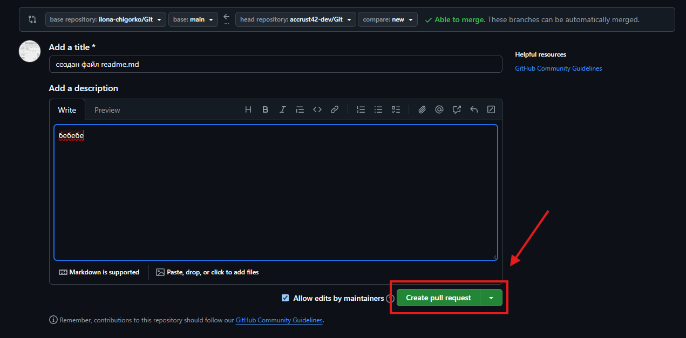

# Шпаргалка по Git

> Команды Git и порядок работы с ними - от установки до создания pull request.

## Содержание

1. [git --version](#1-git---version)
2. [git init](#2-git-init)
3. [git status](#3-git-status)
4. [git add](#4-git-add)
5. [git commit](#5-git-commit)
6. [git log](#6-git-log)
7. [git checkout](#7-git-checkout)
8. [git diff](#8-git-diff)
9. [git branch](#9-git-branch)
10. [git merge](#10-git-merge)
11. [git ignore](#11-git-ignore)
12. [git log --graph](#12-git-log---graph)
13. [git push](#13-git-push)
14. [git pull](#14-git-pull)
15. [Pull request: пошаговый туториал](#15-pull-request-пошаговый-туториал)

---

## 1. `git --version`

Если Git установлен на компьютер, вы увидите его текущую версию.

```bash
git --version
```

## 2. `git init`

Инициализация: указываем папку, в которой Git начнёт отслеживать изменения. В папке создаётся скрытая папка `.git`.

```bash
git init
```

## 3. `git status`

Показывает текущее состояние гита: есть ли изменения, которые нужно закоммитить.

```bash
git status
```

## 4. `git add`

Добавляет содержимое рабочего каталога в индекс (staging area) для последующего коммита. Эта команда даётся после добавления файлов.

```bash
git add .
```

> 💡 Писать название целиком не обязательно: терминал дозаполнит данные автоматически.

## 5. `git commit`

По умолчанию `git commit` использует лишь этот индекс, так что вы можете использовать `git add` для сборки слепка вашего следующего коммита.

Команда `git commit` берёт все данные, добавленные в индекс с помощью `git add`, и сохраняет их слепок во внутренней базе данных, а затем сдвигает указатель текущей ветки на этот слепок.

```bash
git commit -m "Сообщение коммита"
```

## 6. `git log`

Журнал изменений.

```bash
git log
```

> 💡 Перед переключением версии файла в Git используйте команду `git log`, чтобы увидеть количество сохранений.

## 7. `git checkout`

Переключение между версиями. Для работы нужно указать не только интересующий вас коммит, но и вернуться в тот, где работаем.

```bash
git checkout master
```

## 8. `git diff`

Показывает разницу между текущим файлом и сохранённым.

```bash
git diff
```

> 💡 Перед переключением версии файла в Git используйте команду `git log`, чтобы увидеть количество сохранений.

## 9. `git branch`

Создаёт новую ветку.

```bash
git branch <название новой ветки>
```

Переключиться между разными версиями:

```bash
git checkout <название ветки>
```

## 10. `git merge`

Сливает любую ветку с текущей.

```bash
git merge <имя ветки для слияния с текущей>
```

## 11. `git ignore`

Исключает ненужные файлы из загрузки в git. Список исключений задаётся в файле `.gitignore`.

```gitignore
node_modules/
*.log
```

## 12. `git log --graph`

Ключ `--graph` в связке с командой `log` позволяет отобразить коммиты в виде дерева.

```bash
git log --graph
```

## 13. `git push`

Отправить свою версию репозитория во внешний репозиторий поможет команда `git push`. При первом её использовании нужна авторизация.

```bash
git push
```

## 14. `git pull`

Эта команда позволяет скачать всё из текущего репозитория и автоматически сделать merge с нашей версией.

```bash
git pull
```

---

## 15. Pull request: пошаговый туториал

Pull request (PR) - это предложение внести свои изменения в чужой (или общий) репозиторий. Порядок действий такой:

### Шаг 1. Создаём ветку, коммитим и отправляем на GitHub

Работаем в терминале: добавляем файлы в индекс, делаем коммит и отправляем ветку на удалённый репозиторий.

```bash
git add .
git commit -m "создан файл readme.md"
git push
```

Если ветка новая, обычный `git push` выдаст ошибку:

```
fatal: The current branch new has no upstream branch.
```

В этом случае пушим командой с указанием upstream:

```bash
git push --set-upstream origin new
```

После этого в выводе терминала GitHub сам подскажет ссылку для создания PR:

```
remote: Create a pull request for 'new' on GitHub by visiting:
remote:      https://github.com/accrust42-dev/git/pull/new/new
```



### Шаг 2. Переходим к созданию PR

На странице репозитория появляется баннер с кнопкой **Compare & pull request** - жмём её.


### Шаг 3. Заполняем форму и создаём PR

На странице сравнения проверяем:

- **base repository** и ветку `main` - куда вливаем изменения;
- **head repository** и ветку `new` - откуда берём изменения;
- зелёная надпись `Able to merge` - конфликтов нет, ветки можно слить автоматически.

Заполняем **Add a title** (кратко, что сделано) и **Add a description** (подробности), затем жмём зелёную кнопку **Create pull request**.



> 💡 Галочка **Allow edits by maintainers** разрешает владельцу репозитория самому править вашу ветку - обычно её оставляют включённой.

Готово - PR создан, осталось дождаться, пока его посмотрят и смержат в основную ветку.
